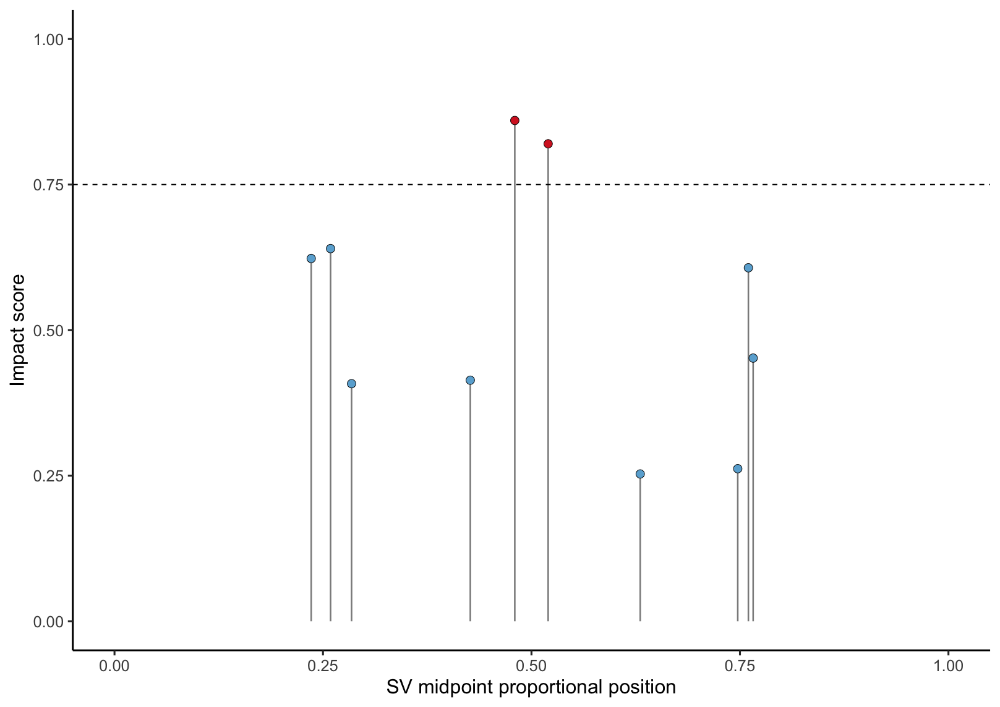
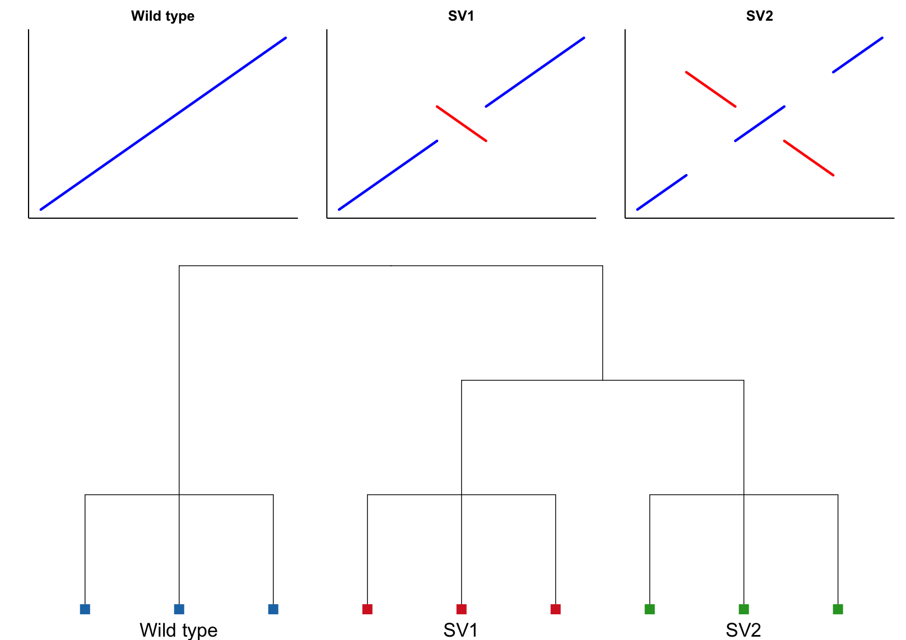

[](LICENSE)


**SV_phylo** is an R package for constructing phylogenies with **structural variant (SV) data** in bacterial genomes.  
It builds on the [`SVMC`](https://github.com/mdiorio371/SVMC) package, which performs SV mapping and characterization, by providing methods to:

- Cluster large-scale SVs
- Calculate systematic impact scores for each SV based on genetic distance
- Compare SV-based phylogenies with SNP/reference trees  

---


### 1. Identifying impactful structural variants
Score recurrent SVs by their contribution to clustering and phylogenetic separation.  


<p align="center">
  
</p>

---

### 2. Viewing SVs in a phylogenetic context


<p align="center">
  
</p>


## Installation

Both **SV_phylo** and [**SVMC**](https://github.com/mdiorio371/SVMC) are needed: 

```r
# install devtools if not already installed
install.packages("devtools")

# install SVMC first
devtools::install_github("mdiorio371/SVMC")

# then install SV_phylo
devtools::install_github("mdiorio371/SV_phylo")


library(SVMC)
library(SV_phylo)

# 1. Generate structural variant calls with SVMC
sv_table <- SVMC("Salmonella_enterica", n = 200, method = "One-vs-all")

# 2. Cluster genomes by large structural variants
SV_clusters <- sv_cluster(sv_table, minLength = 5e4)

# 3. Subsample clusters and generate parSNP phylogeny
cluster_subsample <- subsample_sv_clusters(SV_clusters, n = 3)
snp_clusters <- snp_phylo(cluster_subsample)

#4. Identify phylogenetically impactful SVs

impact_SVs <- SV_SNP_Models(SV_clusters, snp_clusters)

#4. Plot phylo tree with annotated SVs
SV_SNP_tree <- annotate_tree(impact_SVs$dendro)

plot(SV_SNP_tree, main = "SV phylogeny")


#5. 

SV_clusters <- (dist_mat, method = "nj")


# 5. Plot the tree
plot(tree, main = "SV-based phylogeny")

```
